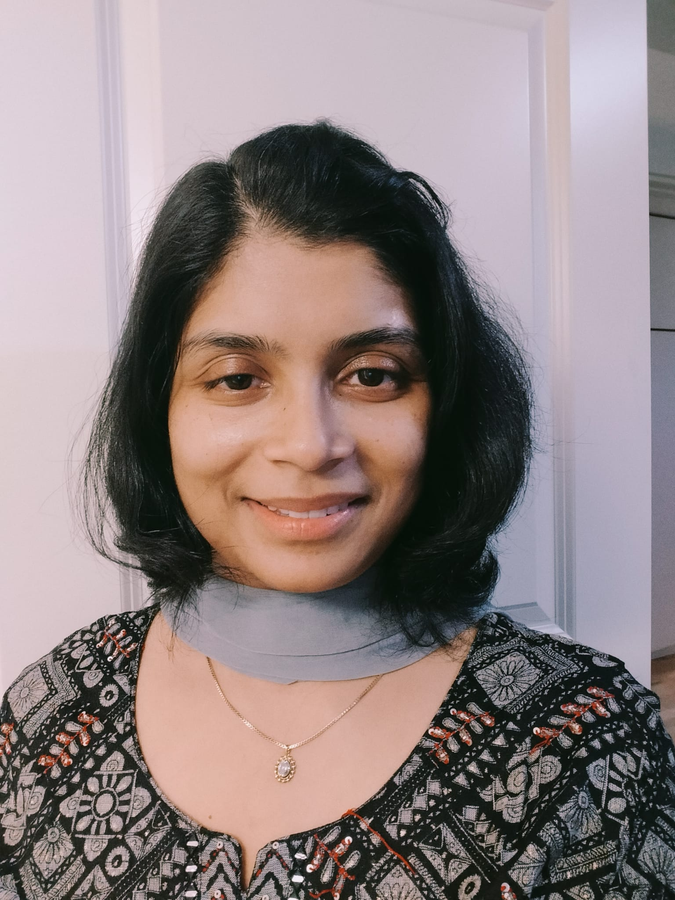

::: {.hero}
::: {.hero-text}

Hi, I’m **Nivedita Bhadra** — a Senior Data Scientist with a background in physics, computational modeling, biomedical data science, and large-scale data systems.

This is my learning and writing space. I document what I am building, debugging, and understanding as I grow in data science, machine learning, statistical genetics, NLP, and modern AI tools.

Many posts are written while I am learning something myself: testing code, fixing errors, building examples, and turning scattered notes into reusable tutorials.

[Explore Tutorials](tutorials/index.qmd){.btn .btn-primary} [Connect on LinkedIn](https://www.linkedin.com/in/nivedita-bhadra-b5149130/){.btn .btn-secondary}

:::

::: {.hero-image}
{width=220}

  
*Senior Data Scientist*
:::
:::

---

## About Me

I work at the intersection of **data science, machine learning, biomedical research, and computational analysis**. My background is in physics and computational modeling, and over time I have moved toward applied machine learning, NLP, statistical genetics, and production-oriented data workflows.

My aim is to make complex technical topics easier to understand through practical examples, readable code, and honest notes from real learning.

---

## Areas I Write About

::: {.grid}
::: {.card}
### Data Science & ML
Python, R, model evaluation, robust ML workflows, and production-oriented analysis.
:::

::: {.card}
### NLP & LLMs
Transformers, local LLMs, sentiment analysis, topic modeling, and applied text analytics.
:::

::: {.card}
### Statistical Genetics
Liability-scale models, GWAS notes, polygenic scores, and biomedical data analysis.
:::

::: {.card}
### Technical Workflows
GitHub, SQL, Dask, Snakemake, Quarto, reproducible notebooks, and data pipelines.
:::
:::

---

## Why I Write

I write because learning becomes deeper when it is explained clearly.

This blog is for people who are trying to build a similar path: researchers moving into data science, scientists strengthening computational skills, beginners learning Python or R, and professionals trying to understand modern machine learning workflows.

---

You can find my research publications here:  
👉 [Google Scholar Profile](https://scholar.google.com/citations?hl=en&user=EWoE7sgAAAAJ&view_op=list_works&sortby=pubdate)

---

## Subscribe / Follow

I’m still setting up a formal subscription option. For now, you can follow or connect here:

- GitHub: [BNTechie](https://github.com/BNTechie)
- LinkedIn: [Nivedita Bhadra](https://www.linkedin.com/in/nivedita-bhadra-b5149130)
- Medium: [@nivedita.home](https://medium.com/@nivedita.home)
- Email: nivedita.home@gmail.com

> If something helped you, feel free to share, comment, or connect.
