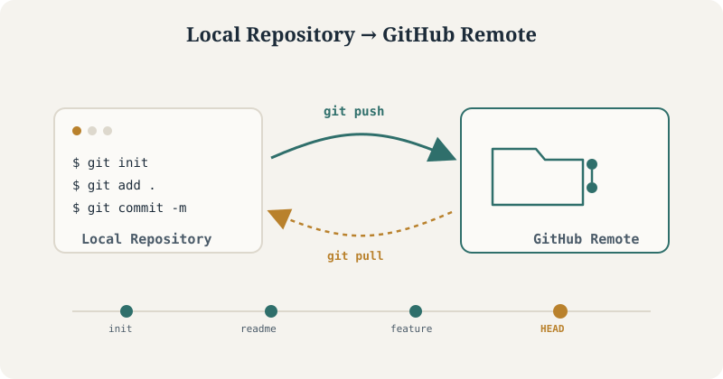

::: {.thesis-hero-wrap}


::: {.thesis-hero-caption}
The core workflow this tutorial covers: initialize locally, commit your work, and push it to a hosted GitHub remote.
:::
:::

Version control is the foundation of any reproducible project, whether you're managing a single analysis script or a multi-contributor codebase. This tutorial walks through the complete lifecycle of a Git-tracked project — from initializing a local repository to hosting it on GitHub and keeping the two in sync. Every command below is copy-paste ready for your terminal.

::: {.tag-row}
[Git installed]{.tag} [GitHub account]{.tag} [Terminal access]{.tag}
:::

---

## Create a New Local Project

```bash
mkdir my_project                  # Create project folder
cd my_project                     # Navigate into folder
git init                          # Initialize Git
```

```bash
echo "# My Project" >> README.md  # Create a README file
```

```bash
git add README.md                 # Stage file
git commit -m "Initial commit"    # Commit file
```

---

## Link to GitHub Repository

Before running the commands below, create an empty repository on GitHub — don't initialize it with a README, since your local project already has one.

[Create a new repository →](https://github.com/new){.btn-secondary}

Once created, GitHub will show you a remote URL. Use either of the two methods below to connect it to your local project.

### Method 1: Using HTTPS
```bash
git remote add origin https://github.com/<username>/my_project.git
```

### Method 2: Using SSH (if keys are configured)
```bash
git remote add origin git@github.com:<username>/my_project.git
```

---

## Push Code to GitHub

```bash
git branch -M main                # Ensure branch is 'main'
git push -u origin main           # Push to GitHub
```

---

## Update Changes to GitHub Later

When you make changes locally:
```bash
git status                        # Check modified files
git add .                         # Stage all changes
git commit -m "Describe your changes here"
git push                          # Push updates to GitHub
```

---

## Clone an Existing Repository (Optional)

If you want to work on an existing repo:
```bash
git clone https://github.com/<username>/existing_repo.git
cd existing_repo
```

Make changes, then:
```bash
git add .
git commit -m "Updated files"
git push
```

---

## Next Steps

You now have a fully version-controlled project hosted on GitHub, with a repeatable workflow for committing and pushing future changes. From here, consider exploring branching for parallel feature work, `.gitignore` for excluding files from version control, or GitHub Actions for automating tests and deployments.

::: {.tag-row}
[Branching]{.tag} [.gitignore]{.tag} [GitHub Actions]{.tag} [Pull Requests]{.tag}
:::
